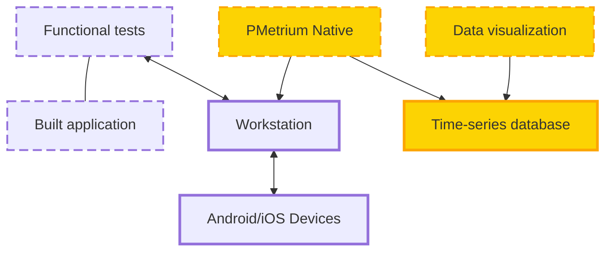

### Functional tests

Functional tests here can be automated or manual as well. Also, it does not matter on what platform you run your tests or what programming language you use (C#, Java, Node.js, etc.)

We created PMetrium Native with the following approach in mind: If you already have functional tests, it should be easy to integrate them with our performance framework. Thus, it won't require you to modify your functional tests.

:::tip Tip

It's up to you what functional tests to perform. PMetrium Native is an external tool for your functional tests, you do not need to modify them. Metrics gathered during testing will represent your testing scenario

:::

### Built application

- The process of native application build is out of scope for us.
- You may take the already packed application into a .apk file or integrate the build process into your functional test 
- PMetrium Native can work with debug and release applications

:::tip Tip

You may even prepare a special version of the application for performance testing for suiting your needs, examples of such cases:
- you may want to open the exact screen directly right after the application launch
- you may want to add some additional  [application-side metrics](../03-development/06-application-events.md)

:::

### Workstation

- Serves as a connection between real devices and functional tests
- Runs functional tests itself based on all needed tools and libraries (such as Appium, Java, .Net, PMetrium Native, etc.) to run the tests remotely\locally
- May be as localhost or CI with all required dependencies

### PMetrium Native

A performance testing framework for native applications. Physically should work on the Workstation.

The general concept of PMetrium Native:
- it works on the host as a web service, which provides some endpoints for communication with the device
- it should be started only once on the host machine
- interaction with devices is based on some bash\shell scripts, one of them works directly on the device
- PMetrium Native can work with a few devices in parallel

### Android/iOS Devices

For functional tests there are three options you may use in terms of devices:
- real devices
- emulators (such Android studio provides)
- docker containers

Each of the three options above gives its pros and cons. In terms of performance testing of native applications we recommend next approaches:
- for debugging the functionality you may use emulators
- to gather real performance metrics you need ONLY real devices
- do not use docker containers

In case you work on localhost you need only few things to be done:
- [prepare workstation](../../how-to/00-prepare-workstation.md)
- [prepare device](../../how-to/01-prepare-device.md)
- [run test locally](../../how-to/02-run-localhost.md)

In case you want to run performance testing on CI you need to take care of device management also known as device farm, which is out of scope for PMetrium Native

### Time-series database

The database is used only to store collected metrics from the device (hardware and application-side metrics). For PMetrium Native we use the InfluxDB time-series database

### Data visualization

Data that is stored in the Database as raw metrics, is visualized in a human-friendly format. For PMetrium Native we use Grafana
