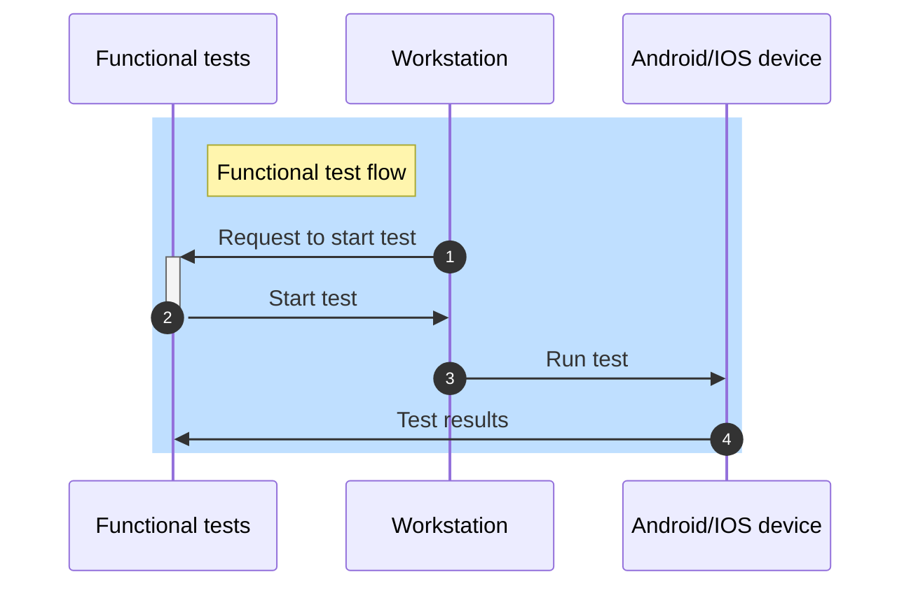
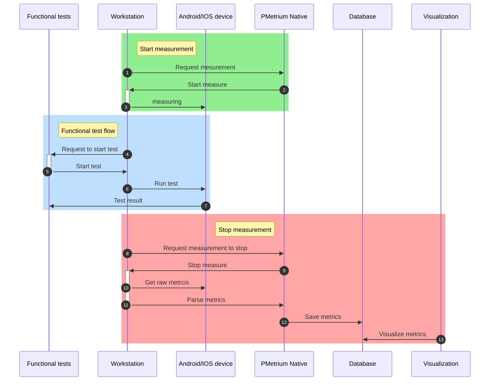

## Functional test Diagram

## Functional test + PMetrium Native Diagram

## Components

### Functional tests

As was mentioned in the Logical diagram, the Functional tests serve as an entry point for our PMetrium Native framework.

### Workstation

Serve as a 'hub' connecting functional test and Android/IOS device that will execute the scenario.
Also, it serves as a 'hub' that collects saved metrics on a device, parses them, and sends them to a database.

### Android/IOS device

Real phone or emulator that is used for functional test execution. 

### PMetrium Native

Our framework is responsible for the performance test execution process. Also, it used to parse obtained raw metrics from the Android/IOS device
and save them in the Database.

### Database

We use a time-series database InfluxDb to save metrics gathered from the device and parsed by our PMetrium Native framework. 

### Visualization

The metrics we gathered should be visualized in a human-friendly format so it could be easy to track trends and observe possible anomalies in terms of the performance of our application.