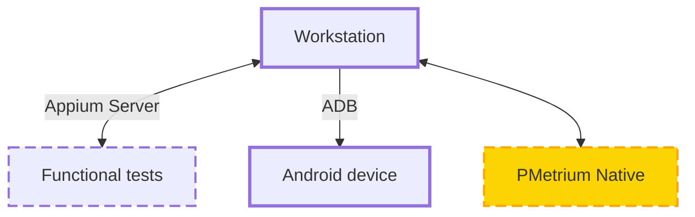

### Appium Server

Appium server is used to run functional tests following the scenario.
Its also used as an intermediary between the functional test and a remote device.
Appium server is also responsible for any actions related to manipulations with the device
(e.g. execute scripts, click on the buttons, etc.)

:::tip
Appium Server is provided here as an example and as a most popular tool.  
**PMetrium Native is a mobile automation tool-agnostic**.
:::

### ADB

Android Device Bridge (ADB) is used to establish a connection between the Android device and the Workstation.

:::important
The whole process of Android device management (so-called device farm) is out of scope for PMetrium Native.  
Thus, this won't be covered in our documentation.
:::
