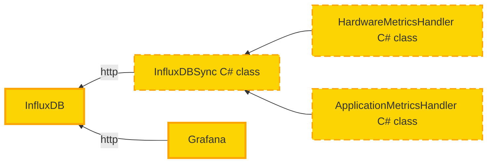

### InfluxDB

InfluxDB is a time-series database that is used to store collected metrics in an appropriate
format.

:::important
**We use InfluxDB version 1.8.x not 2.x.x.**  
The reason behind this is that InfluxDB 2.x.x supports only Flux query language and all our 
Grafana dashboards use older SQL-like language.
:::

### InfluxDBSync C# class

This class is used to send parsed metrics to InfluxDB.

### HardwareMetricsHandler C# class

This class is used to parse the obtained raw metrics from the phone into appropriate
InfluxDB format.

### ApplicationMetricsHandler C# class

This class is used to parse application events gathered from the device.

### Grafana

Grafana is used to visualize metrics stored in InfluxDB.
