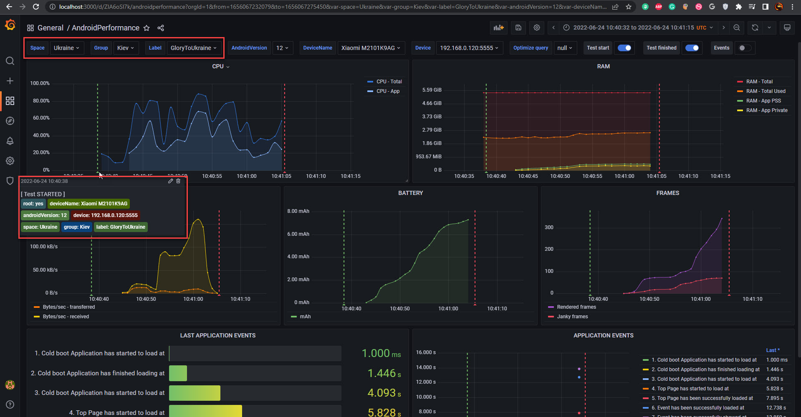

PMetrium Native provides three endpoints that are used to control the execution of performance tests.

### `/Start`

**Start** endpoint is responsible for sending a signal to the PMetrium Native framework to start a performance test pushing scripts to the device and executing them. Example:

```bash
> curl -G -d "device=YourAndroidDeviceName" -d "app=com.parimatch.ukraine" http://localhost:7777/Start
```

:::important
**Start** endpoint requires two parameters to be used: **device** and **app**.
:::

Also, there are multiple **optional parameters** that you could use: <br/>
- `cpuApp=[string]`. Available options: `yes`, `no`
- `cpuTotal=[string]`. Available options: `yes`, `no`
- `ramTotal=[string]`. Available options: `yes`, `no`
- `ramApp=[string]`. Available options: `yes`, `no`
- `networkApp=[string]`. Available options: `yes`, `no`
- `batteryApp=[string]`. Available options: `yes`, `no`
- `framesApp=[string]`. Available options: `yes`, `no`

More about **[PMetrium Native metrics](./05-pmetrium-metrics-android.md)**.
Example of disabling `cpuApp` metric:
```bash
> curl -G -d "device=YourAndroidDeviceName" -d "cpuApp=no" -d "app=com.parimatch.ukraine" http://localhost:7777/Start
```

:::caution 
By default, **all metrics** will be gathered. You could use optional parameters to explicitly
turn off specified metrics.
:::

In case you would like to add some tags for additional quering your metrics in Grafana you may use three more parameters in your http request:
- `space=VALUE`
- `group=VALUE`
- `label=VALUE`

**Note:** We recommend to use VALUE as a space free string, examples: "CamelCase","Under_Line_Score"

Example:

```bash
> curl -G \
    -d "device=YourAndroidDeviceName" \
	-d "app=com.parimatch.ukraine" \ 
	-d "space=Ukraine" \ 
	-d "group=Kiev" \ 
	-d "label=GloryToUkraine" \ 
	http://localhost:7777/Start
```

Result:



### `/Stop`

**Stop** endpoint is responsible for sending a signal to the PMetrium Native framework that the performance test has ended and the framework is ready to proceed with parsing of gathered metrics. Example: 

```bash
> curl -G -d "device=YourAndroidDeviceName" http://localhost:7777/Stop
```

:::important
**Stop** endpoint requires to use **device** parameter only.
:::

### `/Healthcheck`

**Healthcheck** endpoint allows us to verify that PMetrium Native Host has been started successfully and that we could execute performance tests. Example:

```bash
> curl http://localhost:7777/HealthCheck
```