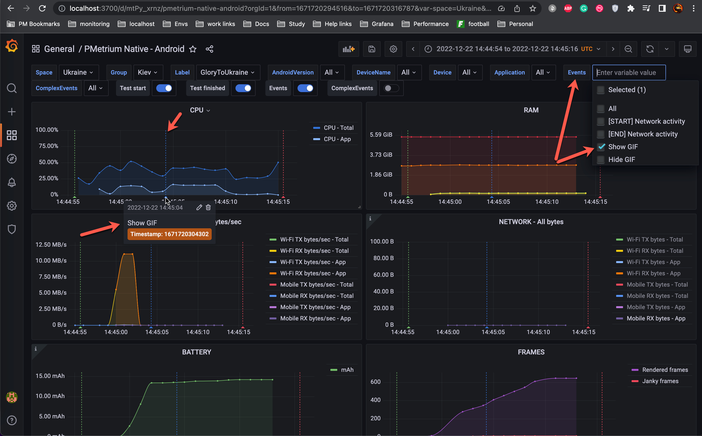
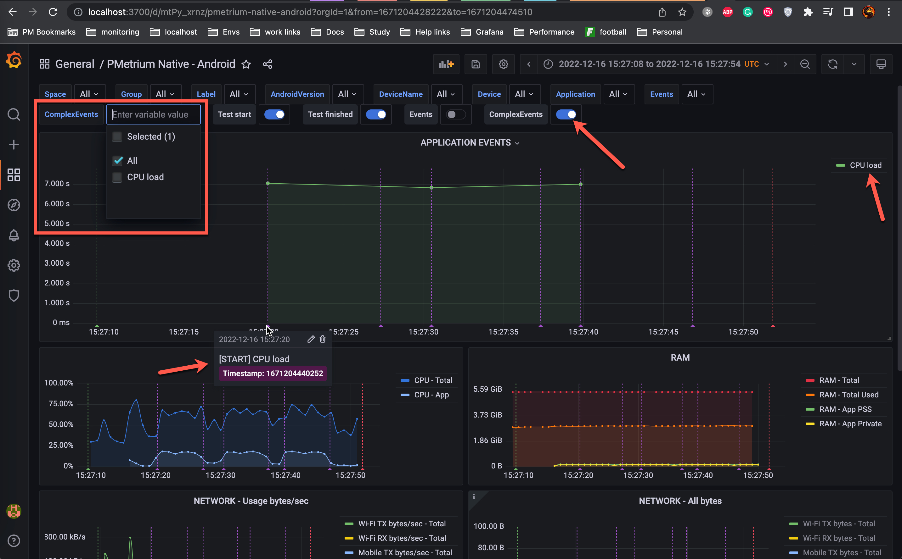
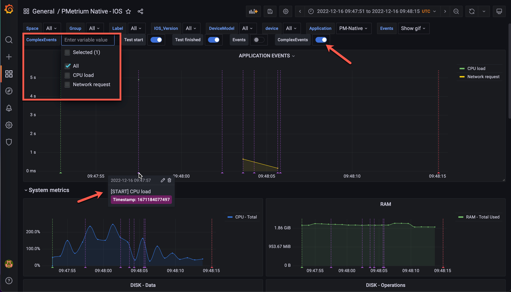

---
title: Application events
sidebar_position: 6
---

While PMetrium Native takes care by default mostly about **[Hardware Metrics](./05-pmetrium-metrics-android.md)** there is an option on how to track some events and their timestamps from inside the application under test. Moreover, starting from the PMetrium Native v2.0 we introduced `ComplexEvent` - event that has the START and the END, so we can measure the latency and show you on the Grafana dashboard. Let's look at the details below.

PMetrium Native tracks those events from logs (logcat for Android and standard Logger for IOS). Events are not required for our application to work, without them you will just received hardware metrics.

## Simple Events

Simple Event - some event in the code of your application with the name and unix timestamp in ms at the end. 

### Example for Android

PMetrium Native takes logs from logcat and searches events. There are three requirements for log for Android:
- log should have tag `PMETRIUM_NATIVE`
- log should have a name, preferable stable name without any changing info
- log should have a unix timestamp in ms at the end of the name, separated by space

So if log looks like example below PMetrium Native will be able to parse it:

`12-16 16:34:55.596  7106  7106 I PMETRIUM_NATIVE: My super event name 1671201295596`

This log was crated in our test application for Android simply by one line of the code:

```js
Log.i("PMETRIUM_NATIVE", "My super event name " + System.currentTimeMillis())
```

As a result you will see your Simple Event in Grafana dashboard:



### Example for IOS

PMetrium Native takes logs for IOS from standard logs mechanism and searches events. There are three requirements for log for IOS:
- log should have tag `[PMETRIUM_NATIVE]`
- log should have a name, preferable stable name without any changing info
- log should have a unix timestamp in ms at the end of the name, separated by space

So if log looks like example below PMetrium Native will be able to parse it:

`Nov 30 17:10:10 PM-Native[633] <Notice>: [PMETRIUM_NATIVE] My super event name 1669821010048`

This log was crated in our test application for IOS simply by one line of the code:

```js
self.defaultLog.log("[PMETRIUM_NATIVE] My super event name \(self.unixTimestampUtc())")
```

Note: your logs method may look a bit different than we have in our application.

As a result you will see your Simple Event in Grafana dashboard:


## Complex Events

Complex Event - it is two simple events that have the same name, but different timestamps. One event is basically means START and the second one the END, so we can measure the latency between START and the END.

Complex Event in terms of requirements and code syntax is almost the same as Simple Event, but with some additional requirements:
- both events must have the same name after tags and before timestamp
- first event name must start from `[START]`
- second event name must start from `[END]`

### Example for Android

So if logs looks like example below for Complex Event PMetrium Native will be able to parse them:

`12-16 16:35:56.188  7381  7381 I PMETRIUM_NATIVE: [START] CPU load 1671201356188`

`12-16 16:36:02.633  7381  7381 I PMETRIUM_NATIVE: [END] CPU load 1671201362633`

These logs were crated in our test application for Android simply by two lines of the code:

```js
Log.i("PMETRIUM_NATIVE", "[START] Complex Event name " + System.currentTimeMillis())

// some your application logic

Log.i("PMETRIUM_NATIVE", "[END] Complex Event name " + System.currentTimeMillis()) 
```

As a result you will see your Complex Event in Grafana dashboard:



### Example for IOS

So if logs looks like example below for Complex Event PMetrium Native will be able to parse them:

`Nov 30 17:10:10 PM-Native[633] <Notice>: [PMETRIUM_NATIVE] [START] Complex Event name 1669821010054`

`Nov 30 17:10:10 PM-Native[633] <Notice>: [PMETRIUM_NATIVE] [END] Complex Event name 1669821010056`

These logs were crated in our test application for Android simply by two lines of the code:

```js
self.defaultLog.log("[PMETRIUM_NATIVE] [START] Complex Event name \(self.unixTimestampUtc())")

// some your application logic

self.defaultLog.log("[PMETRIUM_NATIVE] [END] Complex Event name \(self.unixTimestampUtc())")
```

As a result you will see your Complex Event in Grafana dashboard:


