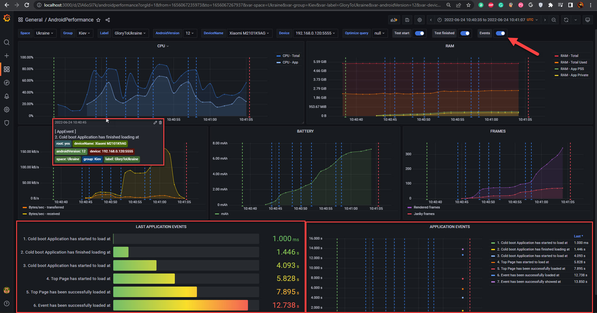

---
title: Application events
sidebar_position: 6
---


While PMetrium Native takes care by default mostly about **[Hardware Metrics](./05-pmetrium-metrics-android.md)** there is an option on how to track some events and their timestamps from inside the application under test. Let's take an example of our Parimatch app and see how to track some events.

First, you have to make sure that your application under test can write logs into logcat. By default, all release-built applications have logcat turned off. We made an agreement with developers to write application events to logcat. Now it is enough to add only one line of code for one event:

```js
LogWrapper.d(PERFORMANCE_TESTING, "Some application-side event" + System.currentTimeMillis())
```

**where:**
- `PERFORMANCE_TESTING` - is a required tag for logcat in order to let PMetrium Native know what to search
- `"Some application-side event"` - whatever human-readable you want to see. 
	:::caution
	We strongly recommend you avoid the events description using any changing information (e.g. EventID). In the opposite way, it will slow down the database significantly
	:::
- `System.currentTimeMillis()` - the Unix timestamp in milliseconds, which should  be at the end!

:::danger PAY ATTANTION
In this example `LogWrapper.d` is just a regular method inside of some project. You may use your own method/wrapper and log `level`, it depends on you and your project. PMetrium Native will take those events from logcat with tags `PERFORMANCE_TESTING` of any log level, examples:

```bash
05-17 16:47:16.183 30844 30844 D PERFORMANCE_TESTING: Cold boot Application has started to load at 1652795236183
05-17 16:47:19.955 30844 30844 D PERFORMANCE_TESTING: Cold boot Application has finished loading at 1652795239955
05-17 16:47:23.513 30844 30844 D PERFORMANCE_TESTING: Cold boot Application has started to load at 1652795243513
05-17 16:47:24.763 30844 30844 D PERFORMANCE_TESTING: Top Page has started to load at 1652795244763
05-17 16:47:28.014 30844 31253 D PERFORMANCE_TESTING: Top Page has been successfully loaded at 1652795248014
05-17 16:47:42.784 30844 31170 I PERFORMANCE_TESTING: Event has been successfully loaded at 1652795262784
05-17 16:47:44.649 30844 30844 I PERFORMANCE_TESTING: Event has been successfully showed at 1652795264649
```
:::

As a result, you will see such a report in Grafana:

