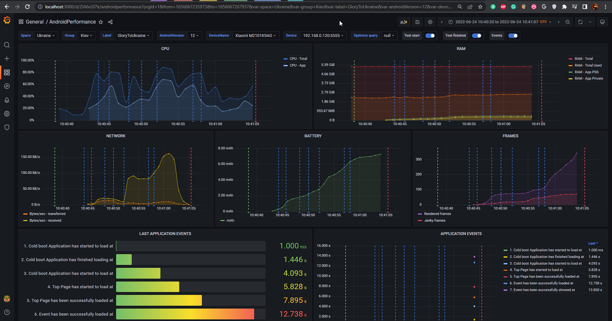

***Workstation*** - in this context is considered to be Localhost rather than CI. For CI please follow this guide **[this guide](./03-run-ci.md)**, as it has some more specific details you need to take care of.

### Prerequisites

The Workstation should have:

- **[Android Debug Bridge (adb)](https://developer.android.com/studio/releases/platform-tools)**
- Docker
- .NET 6+ - **ONLY in case you would like to build or publish PMetrium Native from the source code!**

:::tip
It's expected that you have *adb* available in your CLI from any location. To check that adb commands work as expected you may simply execute the next command:
``` bash
> adb version
```
:::

:::caution
The list above it's a minimum set of prerequisites for PMetrium Native, but you may need some more settings for the Workstation in case you would like to run autotests:
- NodeJS
- AppiumServer
:::

### Run Infrastructure

1. Clone the **[PMetrium Native repository](https://github.com/parimatch-tech/PMetriumNative.git)**
2. Open folder: 
    ``` bash
    cd ./PMetriumNative/Localhost/
    ```

   1. Run docker-compose file for data storage and visualization. No need to change something in the file, all is ready 

       ``` bash
       docker compose -f docker-compose.yml up -d --build
       ```

      ``` yaml title=docker-compose.yml
       version: "3.9"
       services:
         influxdb-pmetrium-native:
             build: ./influxdb
             container_name: influxdb-pmetrium-native
             hostname: influxdb-pmetrium-native
             ports:
              - "8086:8086"
             volumes:
              - influxdb-pmetrium-native:/var/lib/influxdb
             environment:
               - INFLUXDB_DATABASE_NAME=PMetriumNative # InfluxDB user login: admin, password: admin
             restart: always
      
         chronograf-pmetrium-native:
             build: ./chronograf
             container_name: chronograf-pmetrium-native
             hostname: chronograf-pmetrium-native
             depends_on:
              - influxdb-pmetrium-native
             ports:
              - "8888:8888"
             volumes:
              - chronograf-pmetrium-native:/var/lib/chronograf
             restart: always
           
         grafana-pmetrium-native:
             build: ./grafana
             container_name: grafana-pmetrium-native
             hostname: grafana-pmetrium-native
             depends_on:
               - chronograf-pmetrium-native
             ports:
              - "3000:3000"
             volumes:
              - grafana-pmetrium-native:/var/lib/grafana
             environment:
               - INFLUXDB_DATABASE_NAME=PMetriumNative # Grafana user login: admin, password: admin
             restart: always
      
       volumes:
           influxdb-pmetrium-native: 
           chronograf-pmetrium-native:
           grafana-pmetrium-native: 
      ```
3. Once docker compose is started and run you may check if everything is ok, go to any browser and open grafana: `http://localhost:3000`, there should be a ready-made dashboard and after test, you will see next:

    :::caution attention
    Grafana credentials:
    - Login: **admin**
    - Password: **admin**
    :::
 
    

### Run PMetrium Native

PMetrium Native works as a Web host in order to have an ability to communicate over HTTP requests with the outer world. See PMetrium API. There are at least three common ways how to start PMetrium Native, see details below.

#### I. Single File Application - download and run (Localhost|CI)
This is the easyest way to work with PMetrium Native as standalone service (server) on your localhost or CI.
Main cons of this approach:
- you do not need .Net installed on your machine/CI runner
- you do not need to build or publish .Net application 

You only need to download the ready .zip with executable files inside for your target OS - **[DOWNLOAD](https://github.com/parimatch-tech/PMetriumNative/tree/main/PackageRegistry)** 

Exemple with the `curl`:
```bash
> curl \
    --header "PRIVATE-TOKEN:YOUR_PRIVATE_TOKEN" \
    -o PMetriumNative.win-x86.v1.0.0.tar.gz \
    "ttps://github.com/parimatch-tech/PMetriumNative/tree/main/PackageRegistry/PMetriumNative.win-x86.v1.0.0.tar.gz"
```

Where:
- `win-x86` - one of the target OS architectures. Available: 
    - `win-x86`, `win-x64`, `win-arm`, `win-arm64`, `osx-x64`, `osx-arm64`, `linux-x64`, `linux-arm`
- `v1.0.0` - version of the ready build package, see **[the full list](ttps://github.com/parimatch-tech/PMetriumNative/tree/main/PackageRegistry)**

Extract archive, open folder and run PMetrium Native server as a separate process. You may add some additional settings to it throught **[PMetrium Native config](../architecture/03-development/03-pmetrium-config.md)**. For example:
	
```bash
> tar -xzf PMetriumNative.win-x86.v1.0.0.tar.gz --directory ./PMetriumNative.win-x86.v1.0.0
> cd ./PMetriumNative.win-x86.v1.0.0
> ./PMetrium.Native.Host &
```
& - move the process to the background on Linux-based runners

#### II. Single File Application - publish and run (Localhost|CI)
A single file application can be very useful for CI, when you may build PMetrium Native on your localhost for a target Workstation OS and then just run it without build action there. See below for how to do that

- Clone the **[PMetrium Native repository](https://github.com/parimatch-tech/PMetriumNative.git)** to the Workstation
- Open the folder <br/> 
	`./PMetriumNative/PMetrium.Native/PMetrium.Native.Host` 
- Run the following command: <br/>
  ```
  dotnet publish -p:PublishSingleFile=true --self-contained true -c Release -r TARGET_OS
  ```
  where: <br/> 
  TARGET_OS - the target OS of the Workstation, so far can be:
	- `win-x86`
	- `win-x64`
	- `win-arm`
	- `win-arm64`
	- `osx-x64`
	- `osx-arm64` - M1,M2 for MacBooks
	- `linux-x64`
	- `linux-arm`
 - then your PMetrium Native as a single executable file will be saved in <br/> `./PMetriumNative/PMetrium.Native/PMetrium.Native.Host/bin/Release/net6.0/TARGET_OS/publish`
 - now you can run PMetrium Native as a Web host

#### III. Run from IDE (Localhost)

- Clone the **[PMetrium Native repository](https://github.com/parimatch-tech/PMetriumNative.git)** to the Workstation and open it in your preferable IDE that supports .Net 6+
- Start the new process for ***PMetrium.Native.Host*** project

:::tip
- You need to run PMetrium Native only once before all your tests. It may be even hosted on your Workstation infinitely (as Appium server does for example)
- You may want to change some settings for PMetrium Native with the help of **[appsettings.json](../architecture/03-development/03-pmetrium-config.md)**
:::

:::danger PAY ATTENTION
PMetrium Native works as a web host and creates some additional processes under the hood, it requires granting some security permissions on the Workstation. For example, on a Windows machine, you will be asked through the pop-up window to grant some permissions right after the command to run the host. On Linux machines, the approach may differ in terms of permissions
:::

#### HealthCheck

After all the setup you can check if the PMetrium Native web host works as expected, just run the command:
```bash
curl http://localhost:7777/HealthCheck
```

The response should be just `OK` if everything is fine