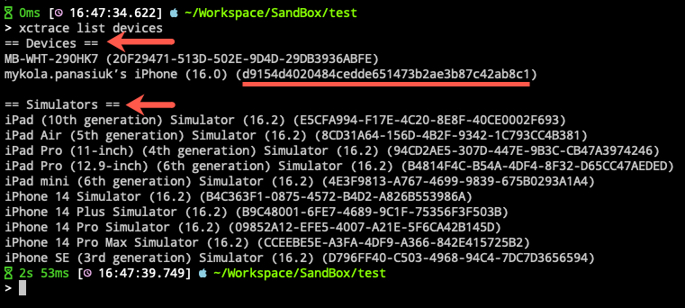

## Android

### Prerequisites

- Workstation has **[Android Debug Bridge (adb)](https://developer.android.com/studio/releases/platform-tools)**
- You have a real Android device
- Your device has activated **[Debug mode](https://developer.android.com/studio/command-line/adb)** (wired or wi-fi)

### Steps
1. Connect your device to the Workstation (wired or wi-fi)
2. Check that your device is visible for your Workstation and take their name/ip: <br/>
	```bash
	> adb devices
	```

	

	Note: if you do not see your device, please look at the sources in the prerequisites
3. Now your devices is ready to work with PMetrium Native. You can run your first performance test for your native app

:::tip
There is an option to use an Android emulator, but we strongly recommend using only REAL devices.
:::

## IOS

### Prerequisites

- Workstation has XCode with cli tool `xctrace`
- You have a real IOS device
- Workstation has installed `libimobiledevice`, more details on **[GitHub](https://github.com/libimobiledevice/libimobiledevice)**

### Steps
1. Connect your device to the Workstation 
2. Check that your device is visible for your Workstation and take their id: <br/>
   ```bash
   > xctrace list devices
   ```

   

3. Now your devices is ready to work with PMetrium Native. You can run your first performance test for your native app

:::caution
PMetrium Native will not be able to work with IOS Simulators. The reason for that is missing the ability for some templates of XCode Instruments to work on Simulators.
:::

